[Home](./) | [Mindset](mindset) | [Community](community) | [Speaking](speaking-events) | [Certifications](certifications) | [Content](content) | [Projects](projects)

## Snowflake ecosystem involvement (chronological)

My involvement with the Snowflake ecosystem has grown steadily over time — across learning, contribution, enablement, and community support. Below is a chronological view of key touchpoints.

---

### 🗓️ 25 March 2025 (duration ~6-7 months) — Snowflake Specialty: GenAI (Content Contribution)
I participated in the Snowflake GenAI Specialty certification program as part of the content contribution process. This included:
- Item writing
- Content review
- Item review discussions  
- Working closely with Snowflake SMEs, including Avan Aziz

While I have not received the official SME badge yet, the experience gave me deeper insight into how Snowflake approaches GenAI concepts with responsibility, clarity, and real-world relevance.

<table>
  <tr>
    <td>
      
    </td>
    <td>
      <a href="assets/events/2_GenAISpeciality_SME.jpg">
        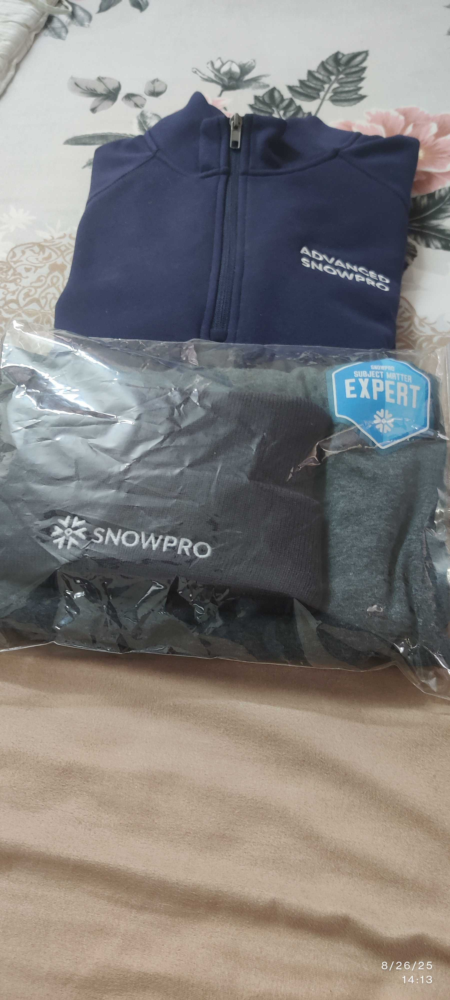
      </a>
    </td>
  </tr>
</table>

---

### 🗓️ 27 March 2025 — Snowflake Breakfast Event, Hyderabad
My company was one of the sponsors for the Snowflake Breakfast Event – Hyderabad Edition. I supported the event and engaged with attendees at the booth, discussing Snowflake use cases, architecture patterns, and real customer challenges.

<table>
  <tr>
    <td>
      <a href="assets/events/1.1_datafor_breakfast_badge.jpg">
        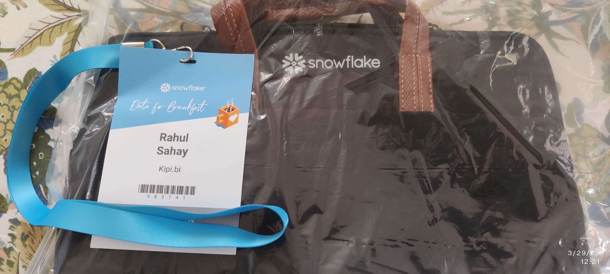
      </a>
    </td>
    <td>
      <a href="assets/events/1.3_datafor_breakfast_team.jpg">
        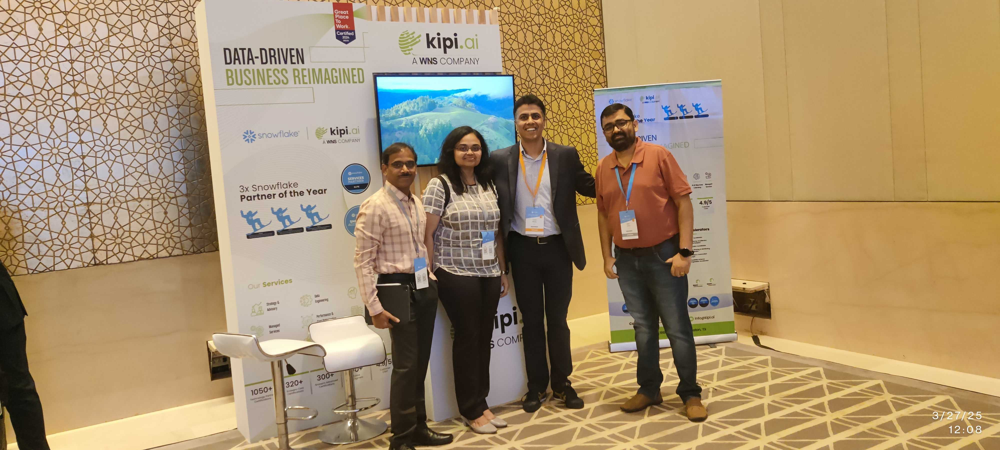
      </a>
    </td>
  </tr>
</table>

---

### 🗓️ 23 July 2025 — Snowflake Squad Global Meetup, Hyderabad
Participated in the Snowflake Squad Global Meetup – Hyderabad. These meetups are valuable because they bring together practitioners to share hands-on experiences, patterns, and lessons learned.

<table>
  <tr>
    <td>
      <a href="assets/events/5_SnowflakeGlobalSquad_Hyd.jpg">
        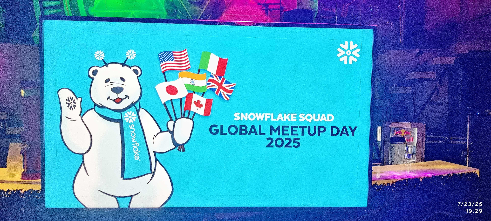
      </a>
    </td>
    <td>
      <a href="assets/events/5.1_SnowflakeGlobalSquad_Hyd.jpg">
        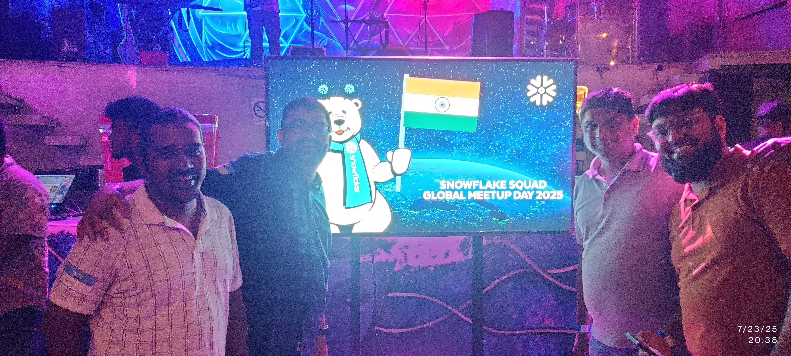
      </a>
    </td>
  </tr>
</table>

---

### 🗓️ 26 July 2025 — Snowflake User Group Hyderabad (Mouritech)
I was part of the organising team for the Snowflake User Group Hyderabad session hosted by Mouritech. My involvement included coordination, supporting the event flow, and helping ensure a good learning experience for attendees.

<table>
  <tr>
    <td>
      <a href="assets/events/3.1_usergroup_Mouritech_coordinator.jpg">
        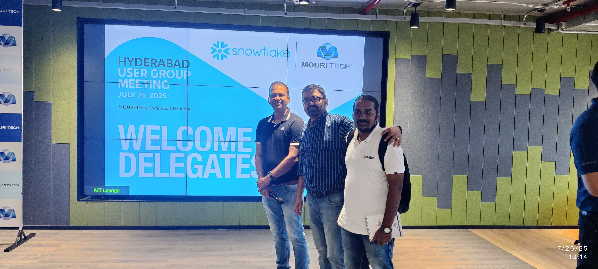
      </a>
    </td>
    <td>
      <a href="assets/events/3_usergroup_Mouritech_coordinator.jpg">
        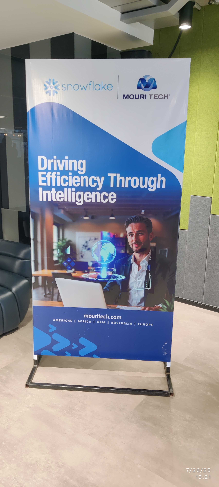
      </a>
    </td>
  </tr>
</table>

---

### 🗓️ 23 August 2025 — Snowflake User Group Hyderabad (Prolifics)
I spoke at the Snowflake User Group Hyderabad session hosted by Prolifics. The session focused on practical Snowflake usage and real-world patterns, aimed at helping practitioners apply concepts beyond documentation.

<table>
  <tr>
    <td>
      <a href="assets/events/4.1_usergroup_profilics_speaker.jpg">
        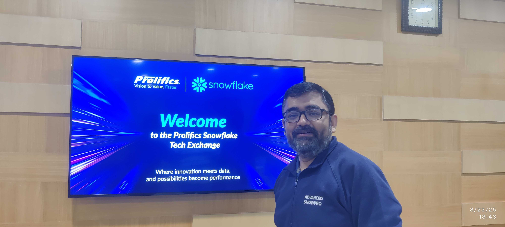
      </a>
    </td>
    <td>
      <a href="assets/events/4_usergroup_profilics_speaker.jpg">
        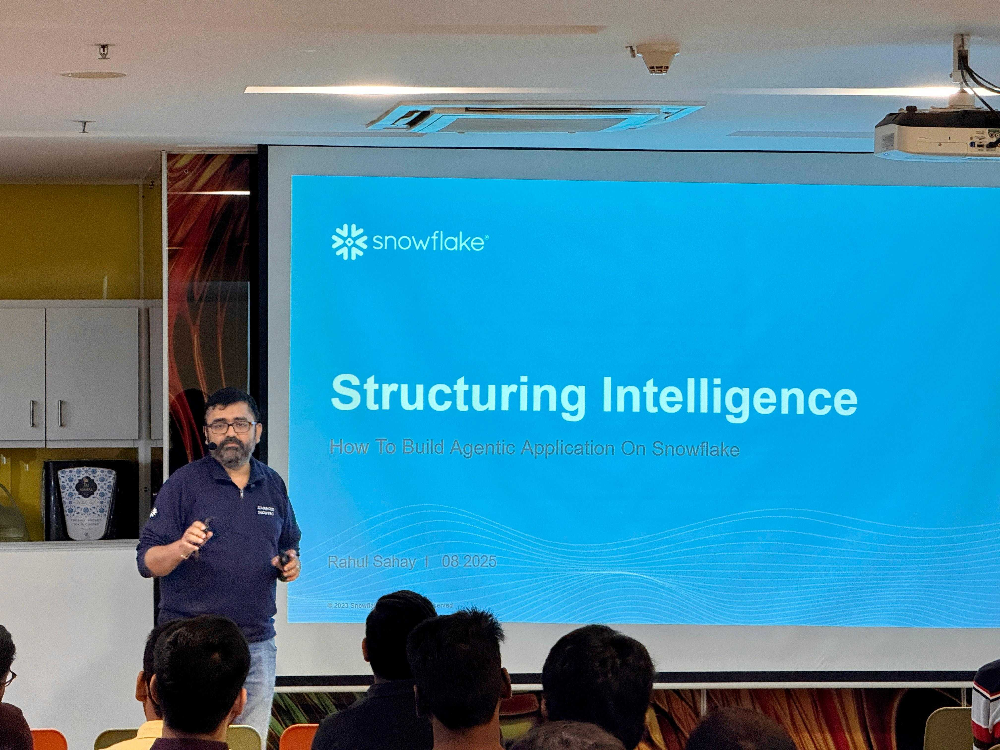
      </a>
    </td>
  </tr>
</table>

---

### 🗓️ 10 September 2025 — Snowflake World Tour, Hyderabad
Attended the Snowflake World Tour – Hyderabad. Events like these are valuable to understand Snowflake’s roadmap, ecosystem direction, and how customers across industries are adopting the platform.

<table>
  <tr>
    <td>
      <a href="assets/events/7.1_SnowflakeWorldTour_Hyd.jpg">
        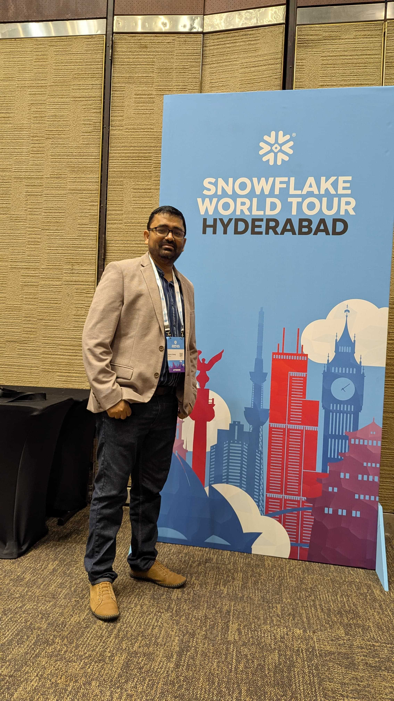
      </a>
    </td>
    <td>
      <a href="assets/events/7_SnowflakeWorldTour_Hyd.jpg">
        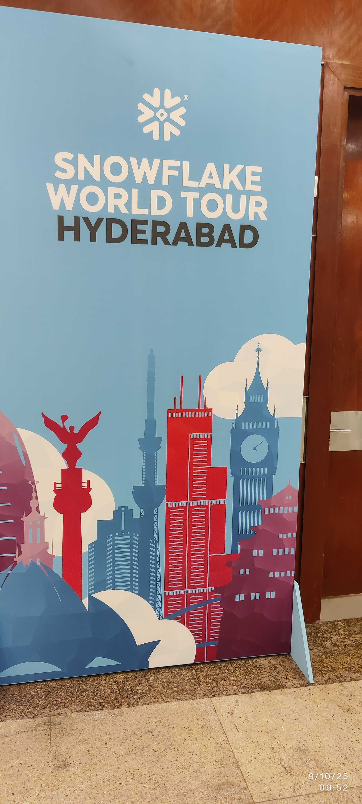
      </a>
    </td>
  </tr>
</table>

---

### 🗓️ 11 October 2025 — Snowflake Northstar, Hyderabad
Contributed as a Lab Partner for Snowflake Northstar – Hyderabad. This involved supporting hands-on labs and helping participants navigate Snowflake concepts in a practical, guided manner.
<table>
  <tr>
    <td>
      <a href="assets/events/6.1_Northstar_Hyd.jpg">
        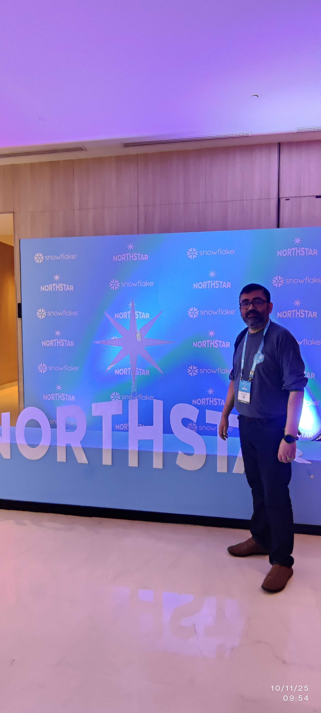
      </a>
    </td>
    <td>
      <a href="assets/events/6_Northstar_Hyd.jpg">
        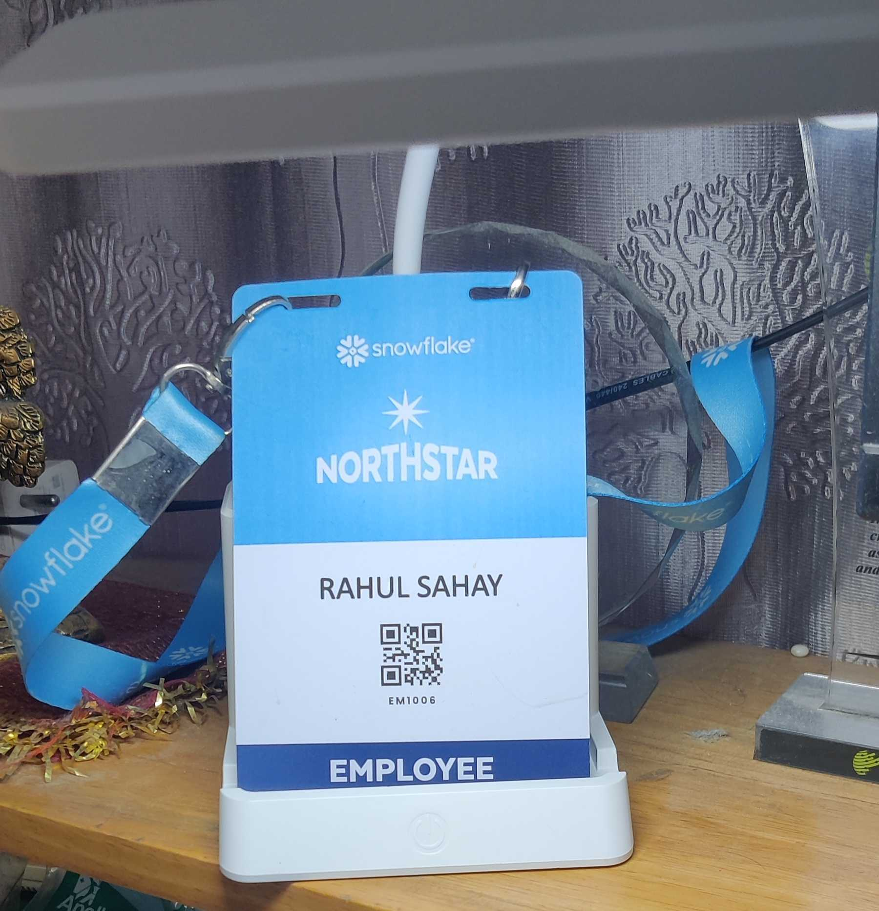
      </a>
    </td>
  </tr>
</table>

---

### 🗓️ 8 December 2025 — Snowflake BUILD, Bangalore
Spoke at Snowflake BUILD – Bangalore. This was a key milestone for me, as BUILD is a practitioner-focused event where sharing real implementation insights and demos matters more than theory.

<table>
  <tr>
    <td>
      
    </td>
    <td>
      <a href="assets/events/8_SnowflakeBuild_Bangalore_Speaker.jpg">
        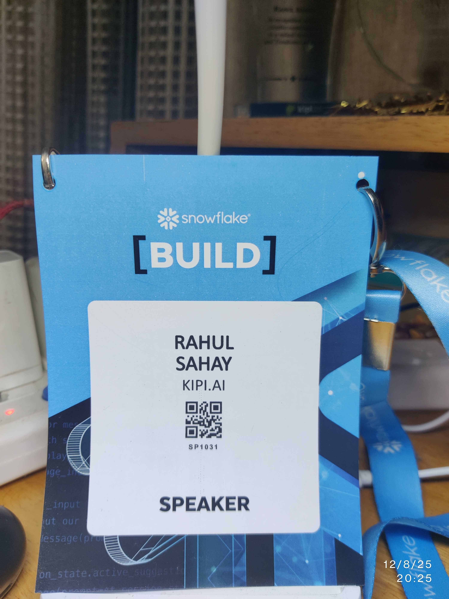
      </a>
    </td>
  </tr>
</table>
