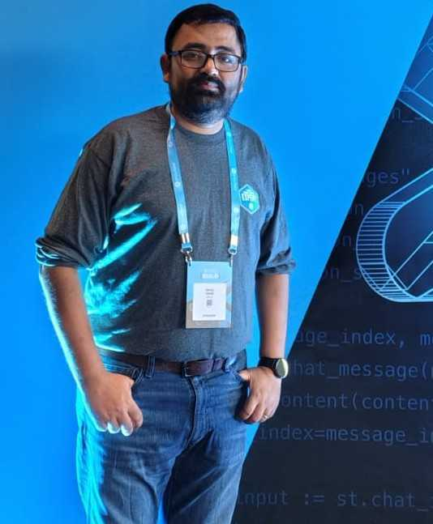

[Home](./) | [Mindset](mindset) | [Community](community) | [Speaking](speaking-events) | [Certifications](certifications) | [Content](content) | [Projects](projects)

---

# Snowflake Data Superhero 2026 — Application (Supporting Evidence)
**Candidate:** Rahul Sahay  
**Theme:** *Mindset first. Trust first. Community first.*

---

## Why I’m applying (in one line)
I try to show up like a Data Superhero — doing the responsible work that improves trust in data, enables others, and helps the wider community learn faster.

---

## Reviewer shortcut (start here)
- ✅ **[Mindset](mindset)** — how I practise stewardship, enablement, long-term thinking  
- ✅ **[Community](community)** — Snowflake + Alation + LangChain + Hyderabad ecosystem  
- ✅ **[Speaking](speaking-events)** — enablement through sessions, meetups, events  
- ✅ **[Certifications](certifications)** — continuous learning (Snowflake + Alation + LangChain)  
- ✅ **[Content](content)** — Medium writing + what I share back  
- ✅ **[Projects](projects)** — demos and practical builds people can reuse  

---

## Evidence map (how to review this site)
This site is structured like a simple Snowflake-style “docs trail”:

1. **Intent & mindset** (what I believe and how I behave)
2. **Community impact** (where I show up consistently)
3. **Enablement** (speaking, sharing, helping others)
4. **Continuous learning** (badges and certifications)
5. **Practical proof** (projects, demos, examples)

---

## Public links (quick verification)
- Snowflake Community: https://snowflake.discourse.group/u/rahul_s_982/summary  
- Medium: https://medium.com/@rahulsahay123  
- GitHub (BUILD demos/wiki): https://github.com/rahulsahay123/snowflake-build-2025/wiki  
- Snowflake Achieve wallet: https://achieve.snowflake.com/profile/rahulsahay123/wallet  
- Credly / Alation badges: https://www.credly.com/users/rahul-sahay.129806dc/badges#credly  

<small>
Note: Some event photos and LangChain badges are not publicly hosted yet. I will upload them into the relevant sections under this site as I consolidate them.
</small>
